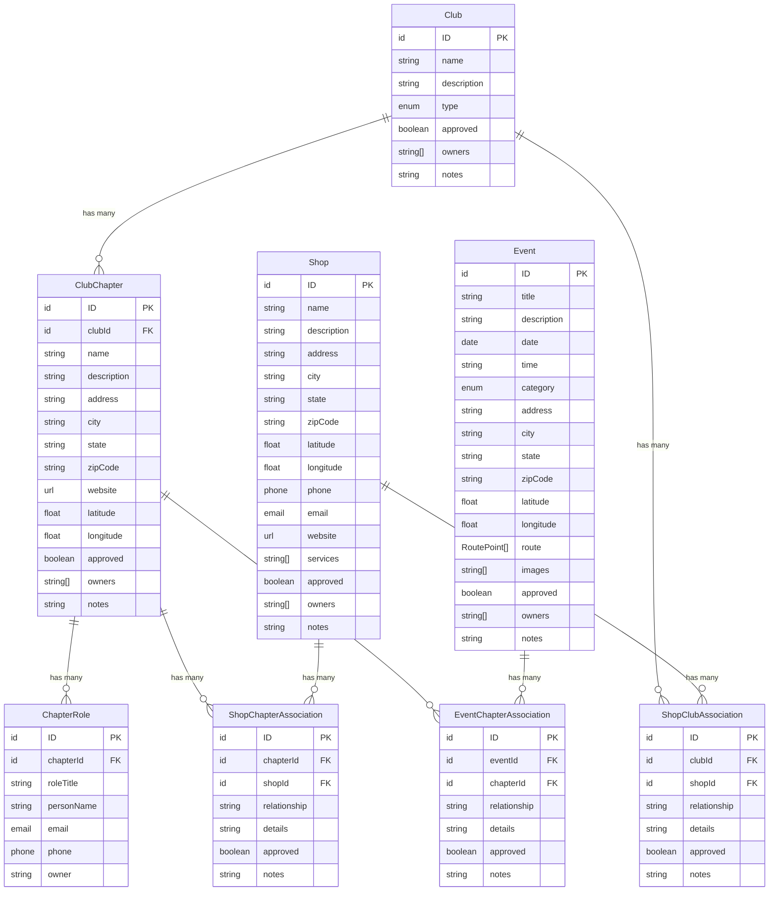

# Database Schema Documentation

This document provides a visual representation of the Veteran Garage Network database schema, including all models and their relationships.

## Entity Relationship Diagram

## Model Descriptions

### Clubs & Chapters

#### Club
The main club entity representing veteran motorcycle clubs and organizations.
- **Key Fields**: name, type, description
- **Location**: Not location-specific (chapters handle locations)
- **Ownership**: Supports multiple owners via `owners` array
- **Approval**: Requires admin approval before being visible

#### ClubChapter
Local chapters or branches of clubs, each with a specific geographic location.
- **Key Fields**: name, address, latitude/longitude
- **Relationships**: Belongs to one Club, has many ChapterRoles
- **Location**: Required latitude/longitude for map placement
- **Ownership**: Supports multiple owners via `owners` array

#### ChapterRole
Leadership positions within a chapter (e.g., President, Vice President, Road Captain).
- **Key Fields**: roleTitle, personName, email, phone
- **Relationships**: Belongs to one ClubChapter
- **Privacy**: Email and phone have restricted access (authenticated users only)

### Shops & Associations

#### Shop
Veteran-friendly businesses and service providers.
- **Key Fields**: name, services, latitude/longitude
- **Location**: Required latitude/longitude for map placement
- **Services**: Array of service types offered
- **Ownership**: Supports multiple owners via `owners` array

#### ShopClubAssociation
Many-to-many relationship between Clubs and Shops.
- **Purpose**: Links clubs to shops they recommend or partner with
- **Key Fields**: relationship, details
- **Approval**: Defaults to approved (true)
- **Naming**: Prefixed with "Shop" to clearly indicate this associates Shops with Clubs

#### ShopChapterAssociation
Many-to-many relationship between ClubChapters and Shops.
- **Purpose**: Links local chapters to nearby shops
- **Key Fields**: relationship, details
- **Approval**: Defaults to approved (true)
- **Naming**: Prefixed with "Shop" to clearly indicate this associates Shops with Chapters

### Events

#### Event
Community events, rides, and gatherings.
- **Key Fields**: title, date, time, category, latitude/longitude
- **Location**: Required latitude/longitude for map placement
- **Route**: Optional array of RoutePoint objects for ride events
- **Media**: Array of S3 image references
- **Ownership**: Supports multiple owners via `owners` array

#### EventChapterAssociation
Many-to-many relationship between Events and ClubChapters.
- **Purpose**: Links events to hosting/participating chapters
- **Key Fields**: relationship, details
- **Approval**: Defaults to approved (true)

## Relationship Patterns

### One-to-Many Relationships
- **Club → ClubChapter**: A club can have multiple chapters
- **ClubChapter → ChapterRole**: A chapter can have multiple leadership roles
- **Club → ShopClubAssociation**: A club can be associated with multiple shops
- **ClubChapter → ShopChapterAssociation**: A chapter can be associated with multiple shops
- **Shop → ShopClubAssociation**: A shop can be associated with multiple clubs
- **Shop → ShopChapterAssociation**: A shop can be associated with multiple chapters
- **Event → EventChapterAssociation**: An event can be associated with multiple chapters
- **ClubChapter → EventChapterAssociation**: A chapter can be associated with multiple events

### Many-to-Many Relationships (via Junction Tables)
- **Club ↔ Shop** (via ShopClubAssociation)
- **ClubChapter ↔ Shop** (via ShopChapterAssociation)
- **Event ↔ ClubChapter** (via EventChapterAssociation)

## Authorization Patterns

All models follow a consistent authorization pattern:

### Public Access
- **Guest users**: Read-only access to approved content
- **Authenticated users**: Read and create access

### Owner Access
- **Single owner**: Uses `allow.owner()` (ChapterRole, associations)
- **Multiple owners**: Uses `allow.ownersDefinedIn('owners')` (Club, ClubChapter, Event, Shop)

### Admin Access
- **Admin group**: Full CRUD access to all records
- **Approval management**: Only admins can approve/reject content

### Field-Level Authorization
Certain sensitive fields have restricted access:
- **approved**: Only admins can modify
- **owners**: Owners and admins can manage
- **notes**: Only owners and admins can view/edit
- **email/phone** (ChapterRole): Only authenticated users can view

## Custom Types

### RoutePoint
Used in Event model for ride routes:
- **latitude**: float (required)
- **longitude**: float (required)
- **type**: enum (waypoint, start, end, etc.)
- **description**: string (optional)
- **order**: integer (required for sequencing)

## Enums

The schema uses several enums defined in `amplify/config/enums.ts`:
- **CLUB_TYPE_VALUES**: Types of clubs (e.g., MC, RC, etc.)
- **EVENT_CATEGORY_VALUES**: Event categories (e.g., Ride, Meetup, Charity, etc.)
- **ROUTE_POINT_TYPE_VALUES**: Types of route points (e.g., Start, End, Waypoint, etc.)

## Key Design Decisions

1. **Multiple Ownership**: Most entities support multiple owners via `owners` array for shared management
2. **Approval Workflow**: All user-generated content requires admin approval before being publicly visible
3. **Location-Based**: Chapters, Shops, and Events all require latitude/longitude for map features
4. **Association Tables**: Junction tables include metadata (relationship, details, notes) beyond just foreign keys
5. **Field-Level Security**: Sensitive information (email, phone, notes) has restricted access
6. **Default Authorization**: Uses Identity Pool for guest access, with User Pool for authenticated users
7. **Descriptive Naming**: Association models are prefixed with the entity they connect to (e.g., `ShopClubAssociation`, `EventChapterAssociation`) for clarity

## Migration Notes

### Model Renaming (Latest Update)

The following models were renamed to improve clarity and consistency:

| Old Name | New Name | Reason |
|----------|----------|--------|
| `ClubAssociation` | `ShopClubAssociation` | Makes it clear this associates Shops with Clubs |
| `ChapterAssociation` | `ShopChapterAssociation` | Makes it clear this associates Shops with Chapters |

**Impact**: 
- All references in the schema have been updated
- Frontend code using these models will need to be updated to use the new names
- The naming now follows a consistent pattern with `EventChapterAssociation`
- Database tables will be recreated with new names on next deployment

**Migration Steps**:
1. Update all frontend imports and references from `ClubAssociation` to `ShopClubAssociation`
2. Update all frontend imports and references from `ChapterAssociation` to `ShopChapterAssociation`
3. Update any GraphQL queries/mutations using the old model names
4. Deploy the backend changes (this will create new tables)
5. Migrate existing data if needed (or start fresh if in development)
